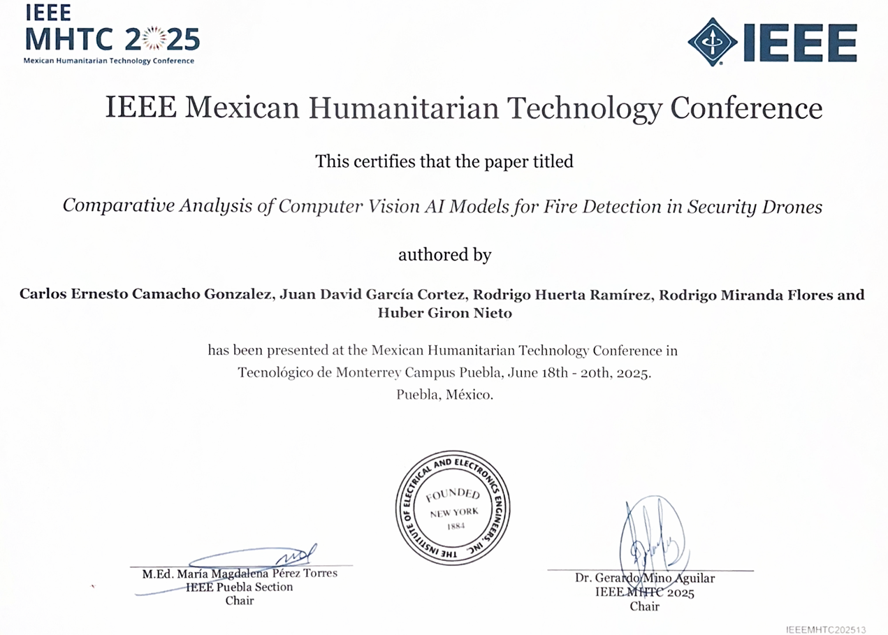

# Security Drone AI — Fire Detection

This project develops and compares two AI models for fire detection in images, 
designed for future integration into a **modular security drone**.

## Summary
- **TM Model:** Fast, easy to implement, but less sensitive.
- **Colab Model:** Custom MobileNetV2 with higher precision and recall, suitable for real-world deployment.

## Key Results
| Metric | TM Model | Colab Model |
|---------|----------|-------------|
| Accuracy | 87.5% | **93.2%** |
| Precision | 0.82 | **0.85** |
| Recall (Sensitivity) | 0.78 | **0.91** |
| F1-Score | 0.80 | **0.88** |
| FPS (CPU i5) | 17.1 | 17.6 |

## Repository Structure
- `src/` - Python scripts for training, evaluation, and real-time detection.
- `models/` - Trained models (.h5, .onnx).
- `docs/` - Project documentation, IEEE certificate, research paper.
- `datasets/` - Dataset links and scripts to download data.

## Certification
Presented at the **IEEE Mexican Humanitarian Technology Conference 2025**.

[**View Full Paper (PDF)**](docs/2025_MHTC_IA_Humo.pdf)

## Future Work
- Optimize models for embedded devices like Raspberry Pi or Jetson Nano.
- Expand datasets to include smoke and environmental factors.
- Integrate fire detection with other drone security features.
